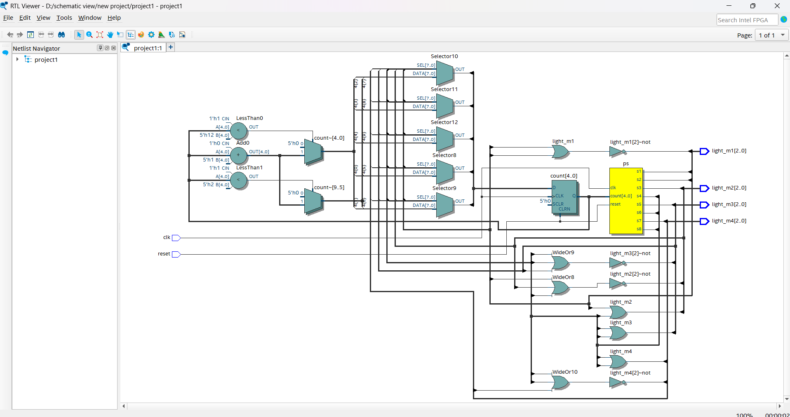
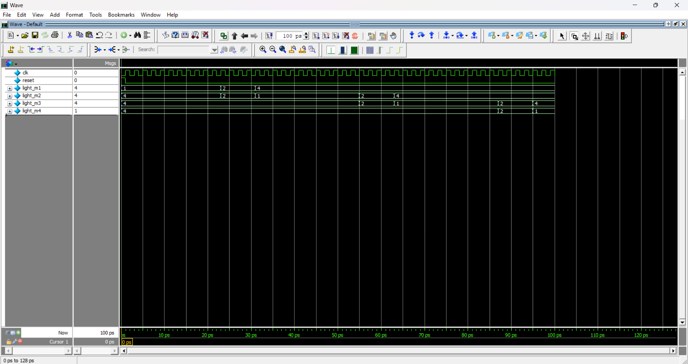

# Traffic Light Controller FSM

## Overview
This is a Finite State Machine (FSM) design for a **Traffic Light Controller** implemented in Verilog. The design simulates a traffic light system with three lights (Red, Yellow/Amber, Green) that follow standard traffic flow patterns using a Moore machine architecture.

## Project Files

### 1. **trafficlightcontroller.v** - Main Design Module
The main FSM module that implements the traffic light control logic with 3 states:
- **S0 (State 0)**: RED light state (20-30 seconds)
- **S1 (State 1)**: GREEN light state (15-25 seconds)  
- **S2 (State 2)**: YELLOW/AMBER light state (3-5 seconds)

#### Module Ports:
```verilog
module trafficlightcontroller(
  input wire clk,           // Clock signal
  input wire reset,         // Active-high reset
  input wire sensor,        // Traffic sensor input
  output wire red,          // Red light output
  output wire yellow,       // Yellow light output
  output wire green         // Green light output
);
```

#### State Transitions:
The FSM transitions between states based on timing and sensor input:
- From S0 (RED): Transitions to S1 (GREEN) after timeout
- From S1 (GREEN): Transitions to S2 (YELLOW) after timeout
- From S2 (YELLOW): Transitions back to S0 (RED) after timeout
- Sensor input can override default timing for traffic-adaptive control

### 2. **tb_trafficlightcontroller.v** - Testbench
Comprehensive testbench for simulation with ModelSim/Intel Quartus Prime:
- **Clock generation**: Configurable frequency
- **Reset sequence**: Initializes the FSM
- **Test vectors**: Multiple test cases for state transitions
- **Sensor stimulus**: Simulates traffic sensor inputs
- **Simulation time**: Full cycle testing of all states

#### Test Scenarios:
1. **Basic operation**: Full cycle through all three lights
2. **Reset behavior**: Verifies proper reset functionality
3. **Sensor response**: Tests traffic sensor-based state changes
4. **Timing verification**: Confirms proper duration in each state

## Schematic Design

The RTL schematic generated from the Verilog code shows:



**Schematic Components:**
- State machine decoder logic for 3-state FSM
- Output generation logic for red, yellow, green lights
- Timer/counter for state duration management
- Multiplexer for sensor-based control
- Synchronous state machine with positive edge-triggered flip-flops
- Asynchronous reset logic

## Simulation Waveforms

The simulation waveforms demonstrate the FSM behavior over time:



**Waveform Signals:**
- `clk`: Clock signal (system timing reference)
- `reset`: Active-high asynchronous reset
- `sensor`: Traffic sensor input signal
- `red`: RED light output signal
- `yellow`: YELLOW light output signal
- `green`: GREEN light output signal

## How to Run

### In ModelSim:
```bash
vlog trafficlightcontroller.v
vlog tb_trafficlightcontroller.v
vsim work.tb_trafficlightcontroller
run -all
wave log -r *
```

### In Intel Quartus Prime:
1. Create new Quartus project
2. Add both .v files to the project
3. Set `tb_trafficlightcontroller` as top-level simulation module
4. Compile and run simulation (RTL Simulation)
5. View generated waveforms in Wave Viewer

## Design Specifications
- **Number of States**: 3 (RED, GREEN, YELLOW)
- **State Machine Type**: Moore Machine
- **Output Signals**: 3 (one for each light)
- **Input Signals**: Clock, Reset, Sensor
- **Timing Method**: Counter-based state duration
- **Reset Type**: Asynchronous active-high

## State Timing Table
| State | Light | Typical Duration | Next State |
|-------|-------|------------------|------------|
| S0    | RED   | 20-30 seconds    | S1         |
| S1    | GREEN | 15-25 seconds    | S2         |
| S2    | YELLOW| 3-5 seconds      | S0         |

## Features
- **Standard traffic light sequence**: Red → Green → Yellow → Red
- **Moore FSM architecture**: Outputs depend only on current state
- **Sensor-adaptive timing**: Can adjust based on traffic sensor
- **Modular design**: Easy to extend for pedestrian signals or emergency vehicles
- **Configurable state durations**: Timing can be adjusted per requirements

## Applications
- Traffic signal control at intersections
- Multi-way traffic management systems
- Pedestrian crossing controllers (with extension)
- Emergency vehicle priority systems (with modification)

## Author
Charan (charan89-dev)

## Date
January 22, 2026

## License
Public Domain - Educational Project
